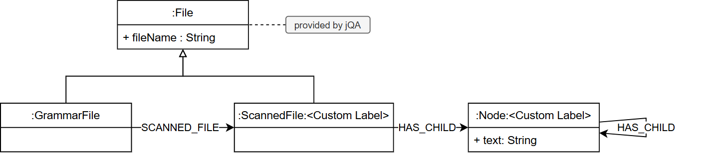

# jQAssistant Plugin for Antlr grammars

This plugin uses antlr grammars to read and parse other files and stores their syntax trees into the jQAssistant Database.

## How to install

Use the jqassistant.yaml as described [here](https://jqassistant.github.io/jqassistant/current/)
and add the following three lines in the plugins section:

```yaml
    - group-id: de.kontext-e.jqassistant.plugin
      artifact-id: jqassistant.plugin.dot
      version: ${version}
```
Version 1.0.0 should be compatible with all jQAssistant versions 2.1.0 and above.

## Configure

To allow for a more fine-grained and stable configuration of this plugin, the decision was made to  move the configuration to a different file. 
To specify the location of the config file for the plugin, add the following property to you .``jqassistant.yaml``:

```yaml
jqassistant:
  scan:
    properties:
      jqassistant.plugin.antlr:
        configLocation: <your/path/here>
```

Within the **plugin configuration file** you can specify the grammars that are to be scanned:
```yaml
jqassistant:
  plugin:
    antlr:
      grammars:
        - fileExtension: '.logging'
          grammarFile: '/Logging.g4'
          grammarRoot: 'log'
          excludedFileLocations:
            - <your/excluded/file/locations>
```

The configuration above tells the scanner the following:
- When it encounters files with the file extension `.logging` it should scan them using the specified grammarFile (``/Logging.g4`` in this case).  
- The grammarRoot property tells the plugin, that the root element of the grammar is the `log` so it knows how to build the syntax tree.
- Files contained in the directories specified at `excludedFileLocations` will not be scanned using this grammar, however, they are still being scanned using another grammar, if the file ending matches with that.

The grammarRoot property can be omitted, defaulting to the grammar name (in this example `Logging`) but as lowercase. 
The property file extension can also be omitted; the resulting default being the grammar file name lowercased (in this case ``'.logging'``).

Additionally, there are two properties to further configure the behavior of the plugin:

````yaml
jqassistant:
  plugin:
    antlr:
      createEmptyNodes: false
      deleteLexerAndParserAfterScan: false
````

### createEmptyNodes
This property allows you to prevent the creation of nodes that would only contain whitespace. The default is set to false, so no whitespace nodes are being created.

### DeleteParserAndLexerAfterScan
This plugin generates the Parser and Lexer during scanning and reuses them throughout the scan, to increase performance. 
To keep performance at a reasonable level, the lexer and parser are by default not being deleted after each scan. 
This however is only beneficial if there is no frequent change to the grammar, as the plugin can not automatically detect if the grammar has changed and thus if the lexer and parser need to be regenerated.

## How it works

When this plugin encounters a file with an extension that was previously configured, it looks up the location of the grammar file and, with the help of the Antlr 4 Java API generates the lexer and parser.
These files can be found in a newly-created directory called ``.antlrPlugin`` next to the grammar file. 
These files are then being compiled using the Java Compiler. These, now usable files, are stored in the same directory. Next, the plugin loads the ``.class``-Files and instantiates the parser using the Java Reflection API. The grammar root is then used to find the method of the parser that returns the entire parse tree.
Finally, the AST is stored into the internal neo4j database directly while adding the name of the parse-tree-nodes to the nodes in the database as a label. Along with this label all nodes representing the AST carry the lable ``:Node`` and all nodes created by the Antlr Plugin carry the Label ``:Antlr``

As generating and compiling classes at runtime is fairly slow the plugin checks if either .java files or .class files are already present and skips the respective steps. To modify this behaviour have a look at the ```jqassistant.plugin.antlr.deleteLexerAndParserAfterScan``` configuration option.

## Data structure

The following diagram is the structure provided by the plugin:



The scanned file is additionally given the name of the grammar as its label and each node gets ist label according to the name of the node in the parse tree. Furthermore, all nodes carry the lable ``:Anltr``. The text of the node is the full text of the token in the parse tree, so the child nodes' text add up to the text in the parent node.  